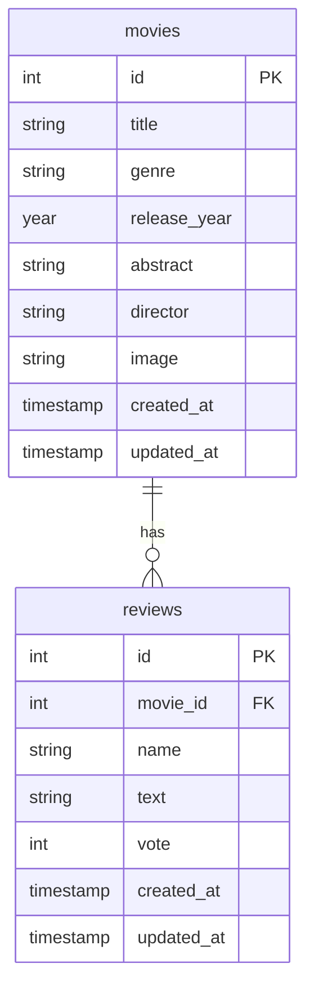

# App Movies reviews

This is a app that allows users to view and submit movie reviews. 


## Database

Name:`db_movies`

**Tables:**
- `movies` - stores information about movies, including title, genre, release date, abstract, director and image.
- `reviews` - stores user reviews for movies, including the review text, rating, and the user who submitted the review.

Table `movies`:

- id PRIMARY KEY AUTO_INCREMENT UNIQUE NOT NULL
- title VARCHAR(255) NOT NULL
- genre VARCHAR(100) NOT NULL
- release_year YEAR NOT NULL
- abstract TEXT NOT NULL
- director VARCHAR(100) NOT NULL
- image VARCHAR(255) NOT NULL
- created_at TIMESTAMP DEFAULT CURRENT_TIMESTAMP
- updated_at TIMESTAMP DEFAULT CURRENT_TIMESTAMP ON UPDATE CURRENT_TIMESTAMP

table `reviews`:
- id PRIMARY KEY AUTO_INCREMENT UNIQUE NOT NULL
- movie_id INT NOT NULL
- name VARCHAR(255) NULL DEFAULT Anonymous
- text TEXT NOT NULL
- vote TINYINT NOT NULL
- created_at TIMESTAMP DEFAULT CURRENT_TIMESTAMP
- updated_at TIMESTAMP DEFAULT CURRENT_TIMESTAMP ON UPDATE CURRENT_TIMESTAMP


### ER Diagram



## Backend SERVER REST API (express.js)

**dependencies:**
- express
- mysql2

### API Endpoints
- `GET /movies` - Retrieves a list of all movies.
- `GET /movies/:id` - Retrieves details of a specific movie by its ID.
- `POST /movies` - Creates a new movie entry.
- `POST /movies/:id/reviews` - Submits a new review for a specific movie.

**payload review:**
```json
{
    "name": "John Doe",
    "text": "Great movie!",
    "vote": 5
}
```

### Setup Server Express.js
1. Install dependencies:
   ```bash
   npm install express mysql2
   ```
2. Create a `.env` file in the root directory and add your database credentials:
    ```
    DB_HOST=localhost
    DB_USER=your_username
    DB_PASSWORD=your_password
    DB_NAME=db_movies
    ```
